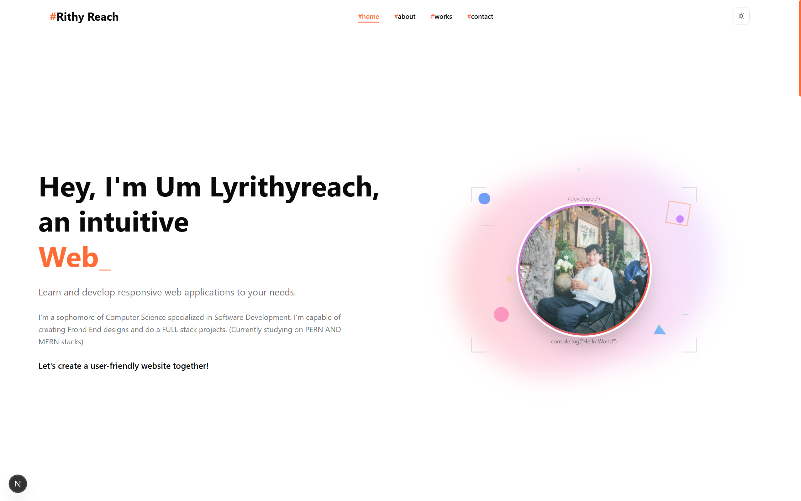

# Portfolio 2.0 - Um Lyrithyreach

A modern, responsive portfolio website showcasing my web development skills and projects. Built with Next.js 15, TypeScript, and Tailwind CSS, featuring smooth animations and a clean, professional design.



## 🚀 Features

- **Modern Design**: Clean, professional interface with dark/light theme support
- **Responsive Layout**: Optimized for all devices and screen sizes
- **Interactive Animations**: Smooth transitions using Framer Motion
- **Project Showcase**: Interactive project gallery with detailed previews
- **Skills Section**: Categorized skills with proficiency indicators
- **Contact Form**: Functional contact form with EmailJS integration
- **Performance Optimized**: Built with Next.js 15 for optimal performance
- **TypeScript**: Full type safety throughout the application
- **Accessibility**: WCAG compliant design patterns

## 🛠️ Tech Stack

### Frontend
- **Framework**: Next.js 15.5.2
- **Language**: TypeScript 5
- **Styling**: Tailwind CSS 4
- **Animations**: Framer Motion 12.23.12
- **UI Components**: Radix UI, ShadCN/UI
- **Icons**: Lucide React, React Icons, FontAwesome

### Features & Integrations
- **Theme**: Next-themes for dark/light mode
- **Email**: EmailJS for contact form
- **Typewriter Effect**: Dynamic text animations
- **Responsive Hooks**: Custom mobile detection hooks

### Development Tools
- **Linting**: ESLint with Next.js config
- **Package Manager**: npm
- **Version Control**: Git

## 📁 Project Structure

```
src/
├── app/                    # Next.js app directory
│   ├── globals.css        # Global styles
│   ├── layout.tsx         # Root layout
│   ├── page.tsx          # Home page
│   └── projects/         # Projects page
├── components/           # React components
│   ├── ui/              # Reusable UI components
│   ├── hooks/           # Custom React hooks
│   └── landingProfile/  # Profile components
├── contexts/            # React contexts
├── data/               # Static data and content
├── lib/                # Utility functions
└── types/              # TypeScript type definitions
```

## 🚀 Getting Started

### Prerequisites
- Node.js 18+ 
- npm or yarn

### Installation

1. **Clone the repository**
   ```bash
   git clone https://github.com/UmLyrithyreach/my-portfolio-nextjs.git
   cd my-portfolio-nextjs
   ```

2. **Install dependencies**
   ```bash
   npm install
   ```

3. **Set up environment variables**
   Create a `.env.local` file in the root directory:
   ```env
   NEXT_PUBLIC_EMAILJS_SERVICE_ID=your_service_id
   NEXT_PUBLIC_EMAILJS_TEMPLATE_ID=your_template_id
   NEXT_PUBLIC_EMAILJS_PUBLIC_KEY=your_public_key
   ```

4. **Run the development server**
   ```bash
   npm run dev
   ```

5. **Open your browser**
   Navigate to [http://localhost:3000](http://localhost:3000)

## 📧 Contact Form Setup

The contact form uses EmailJS for sending emails. To set it up:

1. Create an account at [EmailJS](https://www.emailjs.com/)
2. Create a service and template
3. Add your credentials to `.env.local`
4. The form will automatically work with your configuration

## 🎨 Customization

### Personal Information
Update your personal details in [`src/data/portfolio.ts`](src/data/portfolio.ts):
- Personal info and bio
- Skills and proficiency levels
- Projects and descriptions
- Contact information
- Social media links

### Styling
- **Colors**: Modify the orange theme in Tailwind config
- **Fonts**: Update font families in [`src/app/globals.css`](src/app/globals.css)
- **Components**: Customize UI components in [`src/components/ui/`](src/components/ui/)

### Adding Projects
Add new projects to the `projects` array in [`src/data/portfolio.ts`](src/data/portfolio.ts):

```typescript
{
  id: "unique-id",
  title: "Project Name",
  description: "Project description",
  technologies: ["React", "TypeScript", "Tailwind"],
  image: "/projects/project-image.png",
  liveUrl: "https://project-url.com",
  githubUrl: "https://github.com/username/repo",
  features: ["Feature 1", "Feature 2"],
  category: ["Web Application"],
  status: "Completed"
}
```

## 📱 Responsive Design

The portfolio is fully responsive with breakpoints:
- **Mobile**: < 768px
- **Tablet**: 768px - 1024px  
- **Desktop**: > 1024px

Custom hooks like [`useInMobile`](src/components/hooks/useInMobile.tsx) handle responsive behavior.

## 🎯 Performance

- **Next.js 15**: Latest features and optimizations
- **Image Optimization**: Next.js Image component
- **Code Splitting**: Automatic route-based splitting
- **Tree Shaking**: Unused code elimination
- **Lazy Loading**: Components load on demand

## 🚀 Deployment

### Vercel (Recommended)
1. Push your code to GitHub
2. Connect your repository to [Vercel](https://vercel.com)
3. Add environment variables in Vercel dashboard
4. Deploy automatically on every push

### Other Platforms
The app can be deployed to any platform supporting Next.js:
- Netlify
- Railway
- DigitalOcean App Platform

## 📄 Scripts

```bash
npm run dev      # Start development server
npm run build    # Build for production
npm run start    # Start production server
npm run lint     # Run ESLint
```

## 🤝 Contributing

1. Fork the repository
2. Create a feature branch (`git checkout -b feature/amazing-feature`)
3. Commit your changes (`git commit -m 'Add amazing feature'`)
4. Push to the branch (`git push origin feature/amazing-feature`)
5. Open a Pull Request

## 📝 License

This project is open source and available under the [MIT License](LICENSE).

## 👨‍💻 About Me

I'm **Um Lyrithyreach** (Reach/Kaizen), a sophomore Computer Science student specializing in Software Development. I'm passionate about creating responsive web applications and working with modern technologies like the PERN and MERN stacks.

### Connect with me:
- **Email**: [umlyrithyreach@gmail.com](mailto:umlyrithyreach@gmail.com)
- **GitHub**: [@UmLyrithyreach](https://github.com/UmLyrithyreach)
- **LinkedIn**: [lyrithyreach-um](https://www.linkedin.com/in/lyrithyreach-um-848513364)
- **Telegram**: [@Durian_Lover67](https://t.me/Durian_Lover67)

---

⭐ **Star this repository if you found it helpful!**

*Built with ❤️ by Um Lyrithyreach*